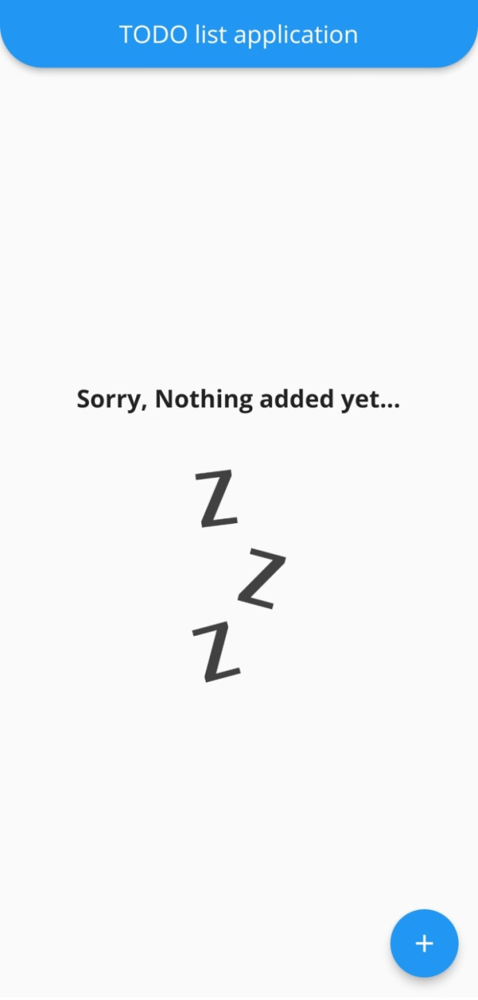
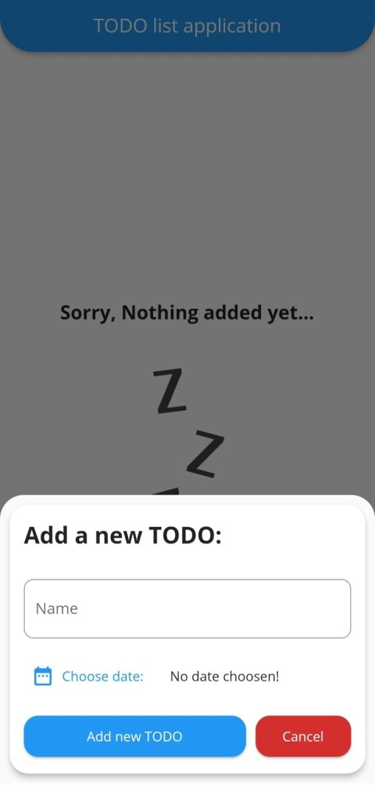
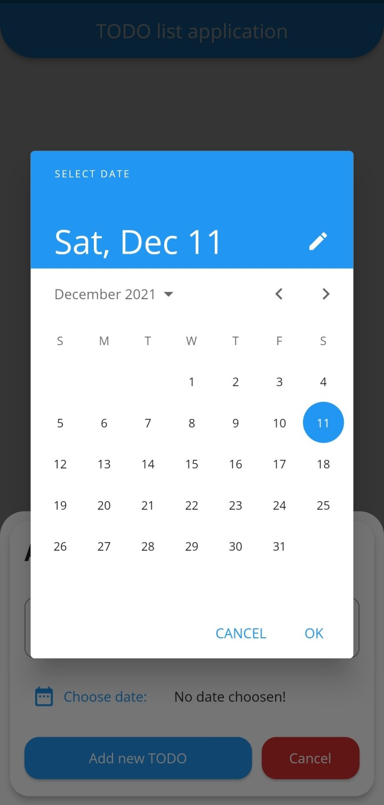
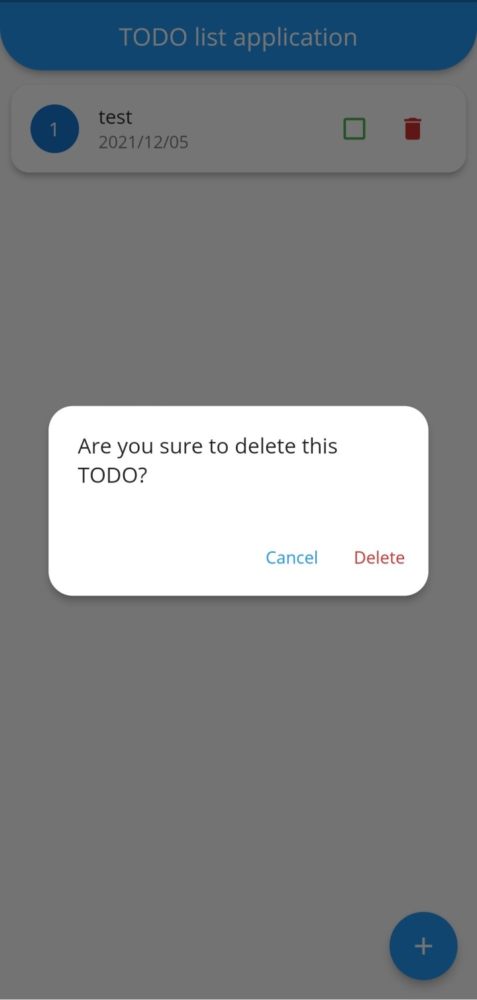
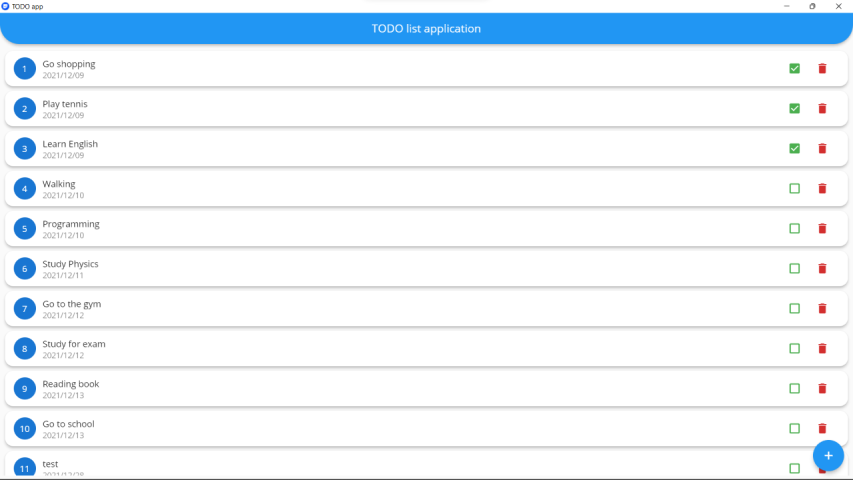
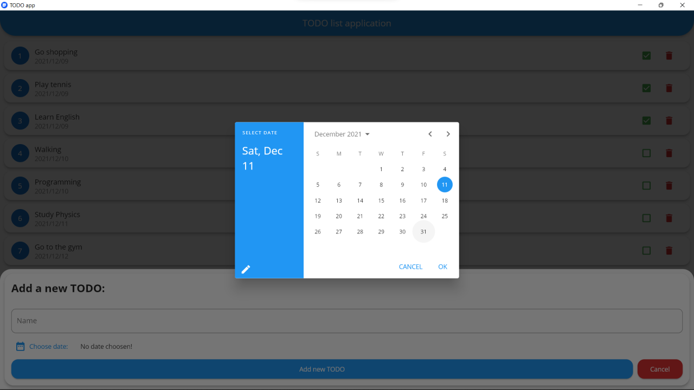
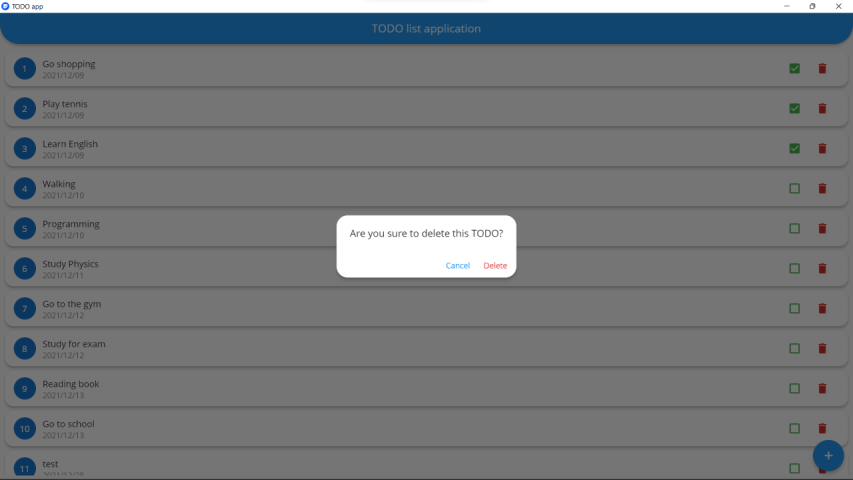
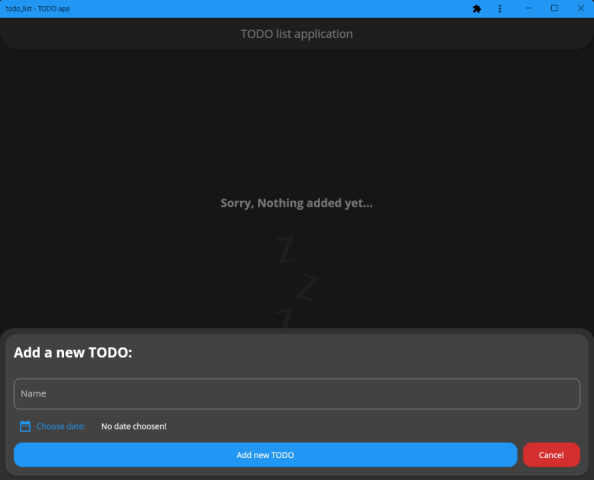
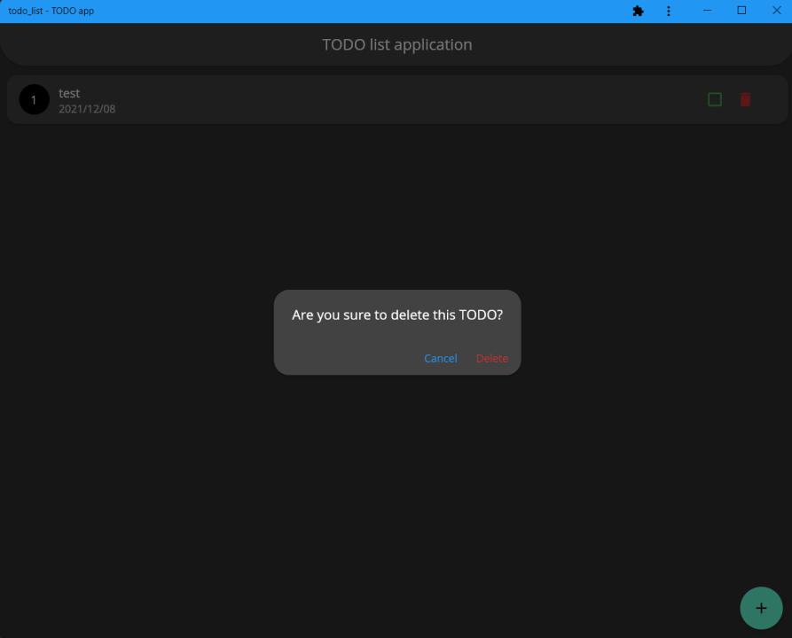

# TODO application

**TODO** apllication for **CS50** final project with flutter framework.

#### Video Demo:  https://youtu.be/91qB2TgGXTc

#### Description:
This is my Final project for ***CS50*** course. This is a **TODO** list application for **Mobile**(Android and iOS), **Desktop**(Windows, Linux and MacOS) and **Web** with **Flutter** framework.

You may ask me **What is a TODo list?** The answer is simple: To Do list is a list of tasks you want to complete, or tasks you want to do and this application helps you to manage your tasks.

About **Flutter** (From documentation):
- Flutter is an open source framework by **Google** for building beautiful, natively compiled, multi-platform applications from a single codebase.
- Flutter code compiles to ARM or Intel machine code as well as JavaScript, for fast performance on any device.
- Flutter is powered by Dart, a language optimized for fast apps on any platform
- ...

In this application to save TODO objects in device storage I used Hive database and as you know Hive is a Fast, Enjoyable and Secure NoSQL Database.

About **Hive** (From documentation):
- Hive is a lightweight and blazing fast key-value database written in pure Dart. Inspired by Bitcask.
- All data stored in Hive is organized in **boxes**. A box can be compared to a table in SQL, but it does not have a structure and can contain anything.
- Cross platform: mobile, desktop, browser.
- ...

To save TODOs with Hive, I make my TODO model like this:
```dart
import 'package:hive/hive.dart';

part 'todo.g.dart';

@HiveType(typeId: 0)
class TODO extends HiveObject {
  @HiveField(0)
  final String id;

  @HiveField(1)
  final String name;

  @HiveField(2)
  final DateTime time;

  @HiveField(3)
  bool done = false;

  TODO({required this.id, required this.name, required this.time});
}
```
I actually used material design for building ui/ux. Another beautiful feature in my project is dark mode supporting, application detects theme mode of the device then apply the correct(light or dark) theme.
For dark mode I added this to the MaterialApp:
```dart
darkTheme: ThemeData(
        brightness: Brightness.dark,
      ),
```

### This is my app logo: 


## Here is a preview of my application in Mobile:

#### This is the empty main page:


#### When you want to create a new TODO you should fill in these fields.


#### When you want to choose a date for the TODO you should select your date from this page.



#### If you want to delete a TODO after click on delete icon, youo chould press the delete text to confirm deleting TODO.


## Here is a preview of my application in Desktop(Windows):

#### This is the main page with some TODOs


#### This is date picker for adding a new TODO


#### This is the warning message to confirm deleting the TODO


## At last its turn to take a look at a preview of my application in Web or PWA app (in dark mode):

#### This is a dark view from main page and adding TODO


#### This is a dark view from confirm deleting warning.


#### This was my ptoject for CS50 course.